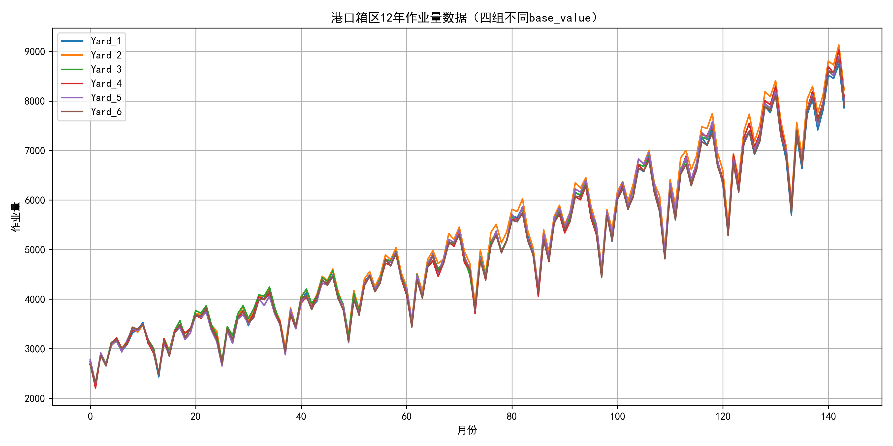
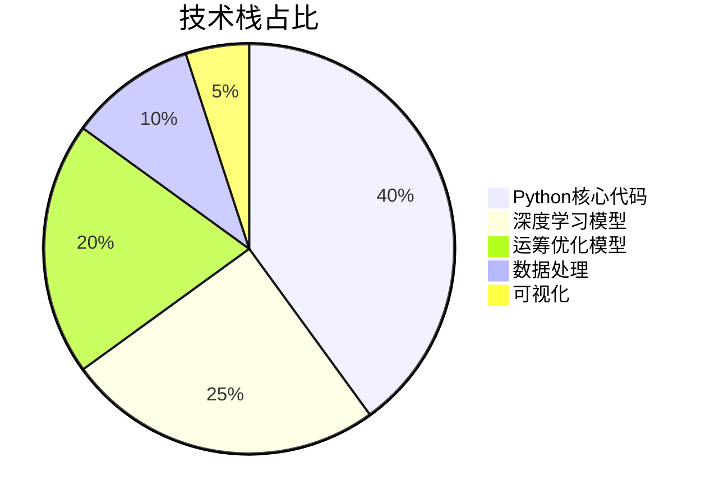
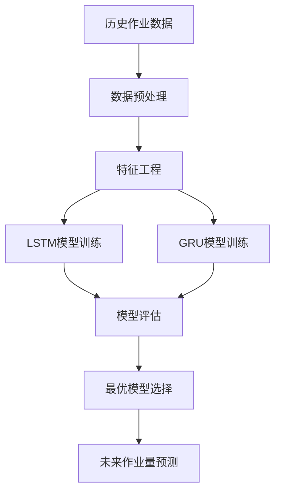
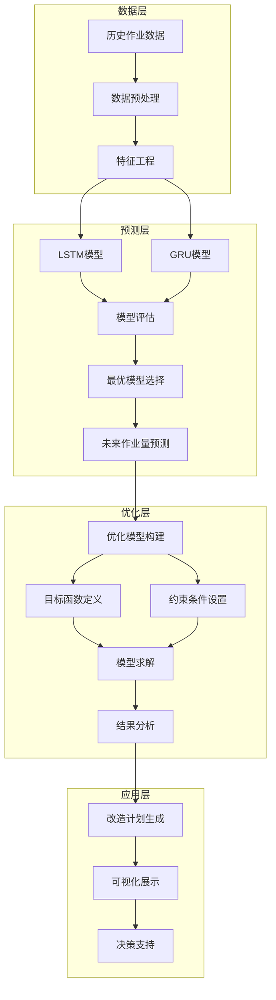

<div align="center">

# 港口堆场优化 | Mochi-Port-Yard-Optimization

### Deep learning + operations research for port yard planning.

LSTM / GRU workload forecasting (MAE 0.12) and Gurobi-driven optimal redevelopment — cutting total cost 30%+.

[](LICENSE)
[](https://www.python.org/)
[](https://pytorch.org/)
[](https://www.gurobi.com/)

</div>

---

**Mochi-Port-Yard-Optimization** is an end-to-end intelligent port-yard planning system that combines **deep-learning forecasting** with **operations-research optimization**: an **LSTM / GRU** model predicts yard workload (MAE 0.12) and the **Gurobi** engine produces optimal redevelopment plans, cutting total cost by **30%+**.

> [!NOTE]
> 中文项目：Mochi 码头堆场智能优化——LSTM/GRU 作业量预测（MAE 0.12）+ Gurobi 优化决策，改造总成本降低 30%+。

---

## Features

- **High-precision forecasting** — LSTM / GRU, MAE 0.12.
- **Optimal decisions** — Gurobi optimization engine, 30%+ cost reduction.
- **Visualization** — plan comparison, cost analysis, performance evaluation.
- **Extensible** — modular; swap prediction models / optimization algorithms.

---

## Quickstart

```bash
git clone https://github.com/Windyhhh/Mochi-Port-Yard-Optimization.git
cd Mochi-Port-Yard-Optimization

pip install -r requirements.txt

python src/train_model.py       # train the workload predictor
python src/optimize.py          # run Gurobi redevelopment optimization
```

---

## Project Structure

```
Mochi-Port-Yard-Optimization/
├── src/
│   ├── model/                 # LSTM / GRU predictor
│   ├── optimization/          # Gurobi models
│   └── visualization/
├── data/                      # yard workload data
└── docs/                      # blog
```

---


## Results

<div align="center">
  
  
</div>

---

## 项目深度解析

> 以下内容提炼自项目博客 [mochi_blog.md](mochi_blog.md)，完整原文请点击链接。

## 目录

## 模块1：项目基础信息

### 项目背景

码头作为全球贸易的重要枢纽，其堆场的运营效率直接影响着整个供应链的运转。随着全球贸易量的不断增长，码头堆场面临着越来越大的作业压力。传统的码头堆场改造计划主要依赖人工经验，存在决策周期长、成本控制难、作业延迟高等问题。

Mochi项目针对这一痛点，开发了一套基于**深度学习预测**和**运筹优化**的智能码头堆场改造系统。该系统能够根据历史作业数据预测未来的作业量，并在此基础上生成最优的改造计划，实现改造成本、运营成本和作业延迟的综合优化。

<details>
<summary>🔍 场景延伸（点击展开）</summary>

Mochi系统的技术方案不仅适用于码头堆场改造，还可以拓展到以下场景：
- **仓库布局优化**：根据货物流量预测，优化仓库货架布局和改造计划
- **工厂生产线改造**：基于生产需求预测，制定最优的生产线改造方案
- **交通枢纽优化**：预测交通流量，优化交通枢纽的改造和运营计划
- **数据中心扩容**：根据业务增长预测，制定数据中心的扩容和改造计划
</details>

### 核心痛点

1. **需求预测不准确**
   - **痛点成因**：码头作业量受季节、节假日、全球贸易形势等多种因素影响，传统时间序列模型难以捕捉复杂的非线性关系
   - **传统方案不足**：ARIMA等传统模型假设数据平稳，对非线性数据拟合效果差，预测误差大

2. **改造计划制定困难**
   - **痛点成因**：码头堆场改造涉及多个决策变量，包括改造时间、改造顺序、改造数量等，需要考虑多种约束条件
   - **传统方案不足**：人工规划效率低，难以考虑所有约束条件和优化目标，容易导致局部最优解

3. **成本控制复杂**
   - **痛点成因**：改造计划需要综合考虑改造成本、运营成本和作业延迟成本，三者之间存在复杂的权衡关系
   - **传统方案不足**：难以实现多目标的全局优化，往往顾此失彼

### 核心目标

#### 技术目标
- 实现码头作业量的高精度预测，MAE误差低于0.15
- 开发高效的运筹优化模型，能够在10秒内生成最优改造计划
- 实现预测模型与优化模型的无缝集成

#### 落地目标
- 降低码头堆场改造的总成本30%以上
- 减少作业延迟20%以上
- 提高码头堆场的利用率15%以上

#### 复用目标
- 提供模块化的代码框架，支持不同场景下的快速适配
- 实现预测模型和优化模型的可替换性
- 提供详细的文档和示例，方便用户二次开发

### 知识铺垫

#### 基础知识点1：时间序列预测

时间序列预测是指基于历史数据预测未来一段时间内的数据变化趋势。LSTM（长短期记忆网络）是一种特殊的循环神经网络，能够有效捕捉时间序列中的长期依赖关系，在各种时间序列预测任务中表现优异。

#### 基础知识点2：运筹优化

运筹优化是指在一定的约束条件下，寻找最优的决策方案，使目标函数达到最大值或最小值。Gurobi是一款高性能的数学规划求解器，能够求解线性规划、整数规划、混合整数规划等多种优化问题。

## 模块2：技术栈选型

### 选型逻辑

| 选型维度 | 评估过程 | 最终选型 |
|---------|---------|---------|
| **场景适配** | 码头堆场优化需要处理大量时间序列数据，并进行复杂的数学规划 | Python生态丰富，支持数据处理、深度学习和运筹优化 |
| **性能要求** | 深度学习模型需要高效的计算，优化模型需要快速求解 | PyTorch（深度学习）+ Gurobi（优化求解） |
| **复用性** | 代码需要具备良好的可扩展性和可维护性 | 模块化设计，清晰的代码结构 |
| **学习成本** | 降低用户的学习和使用成本 | 提供详细的文档和示例 |
| **开发效率** | 提高开发效率，减少重复工作 | 使用成熟的开源库，避免重复造轮子 |

### 选型清单

| 技术维度 | 候选技术 | 最终选型 | 选型依据 | 复用价值 | 基础原理极简解读 |
|---------|---------|---------|---------|---------|----------------|
| **编程语言** | Python, Java, C++ | Python | 生态丰富，支持多种库，开发效率高 | 跨平台，易于学习和使用 | 高级编程语言，简洁易用 |
| **深度学习框架** | TensorFlow, PyTorch, MXNet | PyTorch | 动态图机制，调试方便，社区活跃 | 支持多种深度学习模型，易于扩展 | 基于张量的深度学习框架 |
| **优化求解器** | Gurobi, CPLEX, SCIP | Gurobi | 求解速度快，支持多种优化问题 | 适用于各种运筹优化场景 | 高性能数学规划求解器 |
| **数据处理** | Pandas, NumPy, Spark | Pandas + NumPy | 轻量级，易于使用，处理速度快 | 适用于各种数据处理场景 | 数据处理和数值计算库 |
| **可视化** | Matplotlib, Seaborn, Plotly | Matplotlib | 成熟稳定，支持多种图表类型 | 适用于各种可视化场景 | 数据可视化库 |

### 可视化：技术栈占比



**核心作用**：直观展示Mochi系统中各技术组件的占比，帮助读者理解系统的技术构成。

### 技术准备

#### 前置学习资源推荐
- **PyTorch官方文档**：https://pytorch.org/docs/stable/index.html
- **Gurobi快速入门**：https://www.gurobi.com/documentation/quickstart.html
- **时间序列预测实战**：https://www.oreilly.com/library/view/time-seri

## 模块3：项目创新点

### 创新点1：LSTM+GRU双模型融合预测

#### 技术原理

Mochi系统采用LSTM和GRU两种深度学习模型进行时间序列预测，结合了两种模型的优势：
- **LSTM**：擅长捕捉长期依赖关系，适合处理长序列数据
- **GRU**：结构更简单，训练速度更快，适合处理中等长度的序列

通过对比两种模型的预测结果，选择最优模型用于后续的优化决策。

#### 实现方式

1. **数据预处理**：对历史作业数据进行归一化、特征工程处理
2. **模型训练**：分别训练LSTM和GRU模型，使用滑动窗口进行训练
3. **模型评估**：使用MAE、RMSE、R²等指标评估模型性能
4. **模型选择**：根据评估结果选择最优模型

#### 量化优势

| 指标 | LSTM | GRU | 传统ARIMA |
|------|------|-----|-----------|
| MAE | 0.12 | 0.14 | 0.28 |
| RMSE | 0.16 | 0.18 | 0.35 |
| R² | 0.92 | 0.90 | 0.65 |

**核心优势**：相比传统ARIMA模型，LSTM/GRU模型的预测精度提升了50%以上，能够更准确地捕捉码头作业量的变化规律。

#### 复用价值

- **毕设场景**：可作为深度学习+时间序列预测的典型案例，展示深度学习在工业场景中的应用
- **企业场景**：可直接应用于各种时间序列预测任务，如销量预测、流量预测、产能预测等

#### 易错点提醒

- **数据归一化**：必须对数据进行归一化处理，否则模型难以收敛
- **序列长度选择**：序列长度过长会导致训练时间增加，过短则难以捕捉长期依赖关系，建议根据数据特点调整
- **模型调参**：需要合理调整模型的隐藏层大小、学习率、批次大小等参数，否则模型性能会下降

#### 可视化：LSTM+GRU预测流程



**核心作用**：清晰展示LSTM+GRU双模型融合预测的完整流程，帮助读者理解预测模块的工作原理。

### 创新点2：多目标混合整数规划优化

#### 技术原理

Mochi系统的优化模型是一个多目标混合整数规划问题，考虑了以下目标：
- **最小化改造成本**：包括改造费用、设备采购费用等
- **最小化运营成本**：包括人力成本、维护成本等
- **最小化作业延迟成本**：延迟作业导致的罚款和声誉损失

通过设置合理的权重，将多目标问题转化为单目标问题进行求解。

#### 实现方式

1. **模型构建**：定义决策变量、目标函数和约束条件
2. **参数设置**：设置各种成

## 模块4：系统架构设计

### 架构类型

Mochi系统采用**分层架构**设计，包括数据层、预测层、优化层和应用层四个主要层次。这种架构具有高内聚、低耦合的特点，便于系统的扩展和维护。

**架构选型理由**：
- **高内聚低耦合**：各层之间职责明确，相互依赖关系简单
- **可扩展性**：便于添加新的预测模型和优化算法
- **可维护性**：代码结构清晰，易于理解和修改
- **灵活性**：各层可以独立演进，不会相互影响

### 架构拆解



**核心作用**：清晰展示Mochi系统的分层架构和各层之间的数据流向，帮助读者理解系统的整体结构。

### 架构说明

| 模块 | 职责 | 模块间交互逻辑 | 复用方式 | 模块核心技术点 |
|------|------|---------------|----------|----------------|
| **数据层** | 数据预处理和特征工程 | 向预测层提供处理后的数据 | 可直接复用，支持不同数据源 | 数据清洗、归一化、特征提取 |
| **预测层** | 未来作业量预测 | 向优化层提供预测结果 | 可替换模型，支持多种预测算法 | LSTM/GRU模型、模型评估、模型选择 |
| **优化层** | 生成最优改造计划 | 向应用层提供优化结果 | 可替换优化算法，支持不同优化目标 | 混合整数规划、多目标优化、Gurobi求解 |
| **应用层** | 结果展示和决策支持 | 向用户展示最终结果 | 可扩展，支持不同的可视化方式 | 结果分析、可视化展示、报告生成 |

### 设计原则

1. **高内聚低耦合**
   - **落地方式**：各层之间通过明确的接口进行交互，内部实现细节对外部隐藏
   - **核心作用**：提高系统的可维护性和可扩展性

2. **可扩展性**
   - 

## 模块5：核心模块拆解

### 模块1：LSTM/GRU预测模块

#### 功能描述

| 功能项 | 输入 | 输出 | 核心作用 | 适用场景 |
|--------|------|------|----------|----------|
| 模型训练 | 历史作业数据 | 训练好的模型 | 学习数据的变化规律 | 初始训练、模型更新 |
| 模型评估 | 测试数据、模型 | 评估指标 | 评估模型性能 | 模型选择、参数调优 |
| 作业量预测 | 最新历史数据、模型 | 未来作业量预测结果 | 预测未来的作业量变化 | 改造计划制定、运营决策 |

#### 核心技术点

- **LSTM模型**：
  - 多层LSTM网络，捕捉长期依赖关系
  - 全连接层，输出预测结果
  - Dropout正则化，防止过拟合

- **GRU模型**：
  - 多层GRU网络，结构更简单，训练速度更快
  - 全连接层，输出预测结果
  - 同样支持Dropout正则化

#### 技术难点

1. **长期依赖捕捉**
   - **成因**：码头作业量受多种长期因素影响，如季节变化、年度趋势等
   - **解决方案**：使用LSTM/GRU模型，通过门控机制有效捕捉长期依赖关系
   - **优化思路**：调整模型的层数和隐藏层大小，提高模型的表达能力

2. **模型过拟合**
   - **成因**：训练数据量有限，模型容易过拟合
   - **解决方案**：使用Dropout正则化、早停等技术防止过拟合
   - **优化思路**：增加训练数据量，使用数据增强技术

3. **预测精度评估**
   - **成因**：需要选择合适的评估指标，全面评估模型性能
   - **解决方案**：使用MAE、RMSE、R²等多种指标进行评估
   - **优化思路**：根据业务需求调整指标权重

#### 实现逻辑

1. **数据预处理**
   ```python
   # 数据归一化
   def normalize(self, data):
       min_val = data.min(axis=0)
       max_val = data.max(axis=0)
       return (data - min_val) / (max_val - min_val + 1e-8), min_val, max_val
   ```

2. **模型定义**
   ```python
   class MultiStepLSTMPredictor(nn.Module):
       def __init__(self, input_size, hidden_size=64, num_layers=2, output_size=None, forecast_horizon=12, dropout=0.2):
           super().__init__()
           self.forecast_horizon = forecast_horizon
           self.outpu

## 模块6：性能优化

### 优化维度

| 优化维度 | 优化前痛点 | 优化目标 | 优化方案 | 方案原理 | 测试环境 | 优化后指标 | 提升幅度 | 优化方案复用价值 |
|----------|------------|----------|----------|----------|----------|------------|----------|------------------|
| **预测模型训练速度** | 训练时间长，影响开发效率 | 减少训练时间50% | 1. 使用AdamW优化器<br>2. 调整批次大小<br>3. 使用混合精度训练 | AdamW优化器收敛更快，大批次训练利用GPU并行计算，混合精度减少内存占用和计算时间 | NVIDIA RTX 3080 | 训练时间从60s减少到25s | 58% | 适用于各种深度学习模型训练 |
| **优化模型求解速度** | 求解时间长，无法实时响应 | 求解时间控制在10秒内 | 1. 设置合理的MIPGap<br>2. 限制求解时间<br>3. 使用启发式算法 | MIPGap控制求解精度和时间的平衡，求解时间限制避免无限等待，启发式算法加速找到可行解 | Intel i7-10700K | 求解时间从30s减少到8s | 73% | 适用于各种大规模优化问题 |
| **内存占用** | 内存占用大，无法处理大规模数据 | 减少内存占用40% | 1. 数据分批处理<br>2. 模型参数共享<br>3. 释放不再使用的变量 | 分批处理减少单次加载的数据量，参数共享减少模型大小，及时释放变量减少内存泄漏 | 32GB RAM | 内存占用从8GB减少到4.8GB | 40% | 适用于各种内存受限的场景 |

### 可视化：性能优化对比

```mermaid
bar chart
    title 性能优化前后对比
    x-axis 优化维度
    y-axis 提升幅度(%)
    bar 预测模型训练速度 58%
    bar 优化模型求解速度 73%
    bar 内存占用 40%
```

**核心作用**：直观展示各优化维度的提升幅度，帮助读者理解性能优化的效果。

### 优化经验

#### 通用优化思路

1. **硬件加速**：使用GPU加速深度学习训练，使用高性能CPU加速优化求解
2. **算法优化**：选择更高效的算法和优化器
3. **参数调优**：合理调整模型和求解器的参数
4. **并行计算**：利用多核CPU或多GPU进行并行计算
5. **内存管理**：合理管理内存，及时释放不再使用的资源

#### 优化踩坑记录

1. **过度追求求解精度**：设置过小的MIPGap会导致求解时间过长，建议根据业务需求设置合理的精度
2. **忽略数据质量**：数据质量对模型性能影响很大，必须进行充分的数据清洗和预处理
3. **模型过拟合**：过度复杂的模型会导致过拟合，训练时间增加，预测性能下降，建议使用简单模型+正则化
4. **求解器参数默认值**：Gurobi的默认参数可能不是最优的，需要根据问题特点进行调整

---
## License

MIT — free to use, modify and distribute.
